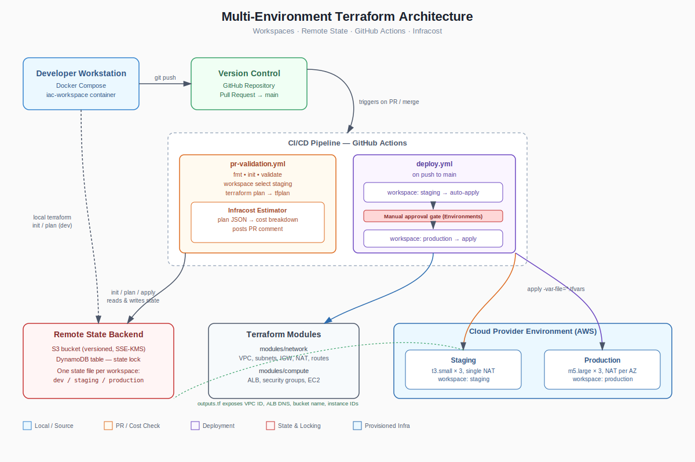

# Multi-Environment Cloud Infrastructure (Terraform + GitHub Actions)

A single Terraform codebase that provisions `dev`, `staging`, and `production`
environments on AWS using Terraform workspaces, with a containerized local
toolchain and a CI/CD pipeline that validates, cost-estimates, and deploys
changes.

## Architecture



The diagram above shows the full flow: a developer works inside the
containerized `iac-workspace`, pushes to GitHub, which triggers the CI/CD
pipeline. The PR workflow plans against `staging` and posts an Infracost cost
comment; the deploy workflow applies to `staging` automatically and to
`production` only after a manual approval gate. Both workflows read and write
state through the locked S3/DynamoDB backend, and the root module composes
the `network` and `compute` modules to provision environment-scoped
infrastructure.

- **State**: S3 backend with versioning + KMS encryption, DynamoDB table for locking.
- **Modules**: `modules/network` (VPC, subnets, IGW, NAT, route tables) and
  `modules/compute` (ALB, security groups, EC2 instances).
- **Environments**: managed via `terraform workspace` (`dev`, `staging`, `production`),
  each with its own `.tfvars` file and isolated state.
- **CI**: `.github/workflows/pr-validation.yml` — format check, init, validate,
  plan against staging, Infracost cost comment on the PR.
- **CD**: `.github/workflows/deploy.yml` — auto-applies to staging on merge to
  `main`; production requires manual approval via a GitHub Environment.

## Requirements Checklist

Verified against this repository's code, one row per core requirement:

| # | Requirement | Where it's satisfied | Status |
|---|---|---|---|
| 1 | Remote backend + state locking | `main.tf` (`backend "s3" {}`), `backend.hcl` (bucket, `dynamodb_table`, `encrypt = true`) | ✅ |
| 2 | Modular architecture (2+ modules) | `modules/network/`, `modules/compute/`, instantiated via `module` blocks in `main.tf` | ✅ |
| 3 | Dynamic workspace-aware config | `terraform.workspace` referenced in `main.tf` (naming, tags) and `modules/network/main.tf` (NAT sizing) | ✅ |
| 4 | Environment-specific `.tfvars` | `environments/dev.tfvars`, `staging.tfvars`, `production.tfvars` with differing `instance_type`/`instance_count`/`az_count` | ✅ |
| 5 | Workspace-suffixed resource names | `local.name_prefix = "${var.project_name}-${terraform.workspace}"` used throughout modules; S3 bucket includes account ID + prefix | ✅ |
| 6 | CI: validate + plan on PR | `.github/workflows/pr-validation.yml` — triggers on `pull_request` to `main`, runs `init`, `validate`, `plan -var-file=staging.tfvars` | ✅ |
| 7 | CD: dynamic workspace/tfvars routing | `.github/workflows/deploy.yml` — selects `staging`/`production` workspace and passes matching `-var-file` per job | ✅ |
| 8 | Manual approval gate for production | `deploy-production` job uses `environment: production`; gated by required reviewers configured in **Settings → Environments** | ✅ |
| 9 | Infracost integration on PRs | `pr-validation.yml` — `terraform show -json`, `infracost breakdown`, `infracost comment github` | ✅ |
| 10 | Containerized local workspace | `Dockerfile` (Terraform, Infracost, AWS CLI), `docker-compose.yml` (`iac-workspace`, volume mount), `.env.example` | ✅ |
| 11 | Exposed outputs (2+) | `outputs.tf` — `vpc_id`, `public_subnet_ids`, `load_balancer_dns_name`, `app_data_bucket_name`, `instance_ids` (5 total) | ✅ |

All 11 core requirements are met. Two implementation notes worth knowing
before you present this:

- **Manual approval gate (#8)** is enforced by GitHub's own `environment:`
  protection rules, not by code in the YAML — you must add a required
  reviewer under **Settings → Environments → production** in the actual
  GitHub repo for the gate to be active.
- **OIDC over static keys**: the workflows assume an IAM role via
  `aws-actions/configure-aws-credentials` (`AWS_PLAN_ROLE_ARN` /
  `AWS_DEPLOY_ROLE_ARN`) rather than long-lived access keys — see
  `oidc-setup/` for the trust policy and permission documents referenced by
  those roles.

## Prerequisites

- Docker and Docker Compose
- An AWS account with permission to create IAM roles, S3, DynamoDB, VPC, EC2, ELB
- An [Infracost](https://www.infracost.io/) API key (free tier)

## One-Time Bootstrap

Terraform cannot create the bucket it needs to store its own state, so the
backend resources are provisioned separately:

```bash
cd bootstrap
terraform init
terraform apply -var="state_bucket_name=my-company-tf-state"
cd ..
```

Update `backend.hcl` with the bucket and table names from the bootstrap output.

## Local Development

1. Copy the environment template and fill in real values (never commit `.env`):
   ```bash
   cp .env.example .env
   ```
2. Build and start the containerized workspace:
   ```bash
   docker-compose up -d --build
   docker-compose exec iac-workspace bash
   ```
3. Inside the container:
   ```bash
   terraform init -backend-config=backend.hcl
   terraform workspace new dev
   terraform workspace new staging
   terraform workspace new production
   terraform workspace select dev
   terraform plan -var-file=environments/dev.tfvars
   ```

## CI/CD Flow

1. A developer opens a PR against `main`. The **PR Validation** workflow runs
   `fmt`, `init`, `validate`, and `plan` against the `staging` workspace, then
   posts an Infracost cost breakdown as a PR comment so reviewers can see the
   monthly cost delta before approving.
2. On merge to `main`, the **Deploy** workflow automatically plans and applies
   to `staging`.
3. The `production` job only runs after a required reviewer approves it in the
   GitHub **Environments** settings (Settings → Environments → `production` →
   Required reviewers). This is the manual approval gate — the workflow itself
   pauses and waits for that approval before running `terraform apply` against
   `production.tfvars`.

## Secrets Required in the Repository

| Secret | Purpose |
|---|---|
| `AWS_PLAN_ROLE_ARN` | Read-only role assumed via OIDC for PR plans |
| `AWS_DEPLOY_ROLE_ARN` | Deploy role assumed via OIDC for staging/production applies |
| `INFRACOST_API_KEY` | Infracost cost estimation |

Credentials are never stored as long-lived access keys in this repo; the
workflows assume an IAM role via GitHub's OIDC provider
(`aws-actions/configure-aws-credentials`). If your organization prefers static
keys, replace the `role-to-assume` step with `aws-access-key-id` /
`aws-secret-access-key` secrets, but OIDC is strongly preferred.

## Handling a Stuck State Lock

```bash
terraform force-unlock <LOCK_ID>
```

Only do this when you are certain no other run is actively applying changes.

## Notes on Production Hardening

- `production.tfvars` disables direct SSH ingress (`allowed_ssh_cidrs = []`);
  use AWS Systems Manager Session Manager for administrative access instead.
- The ALB listens on HTTP (port 80) in this reference implementation; attach
  an ACM certificate and add an HTTPS listener before using this for real
  production traffic.
- Root and app S3 buckets block all public access and use SSE-KMS encryption
  by default.